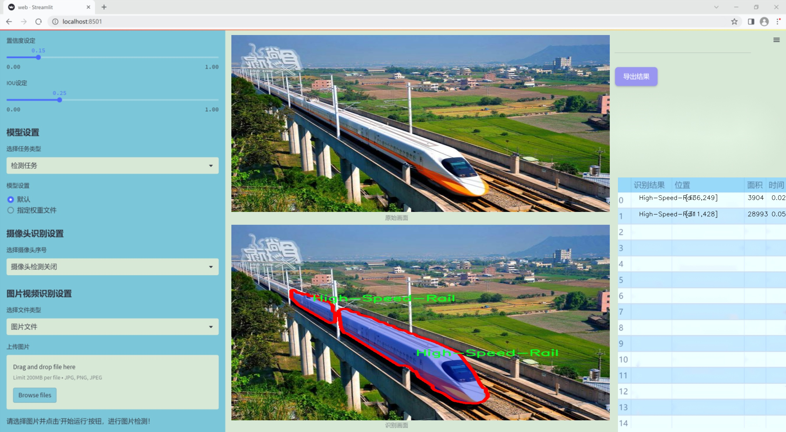
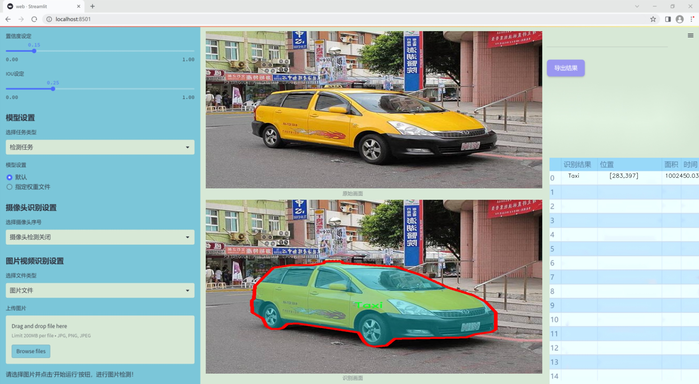
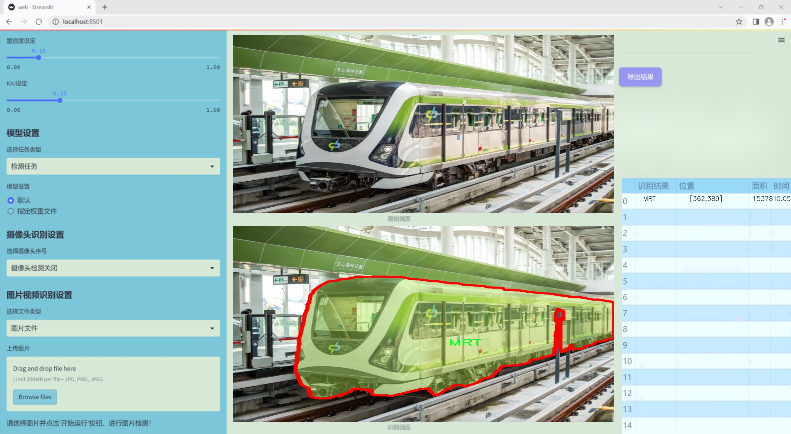
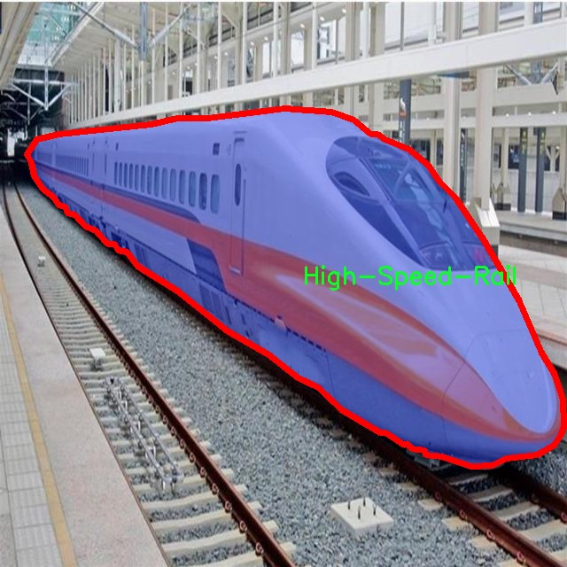
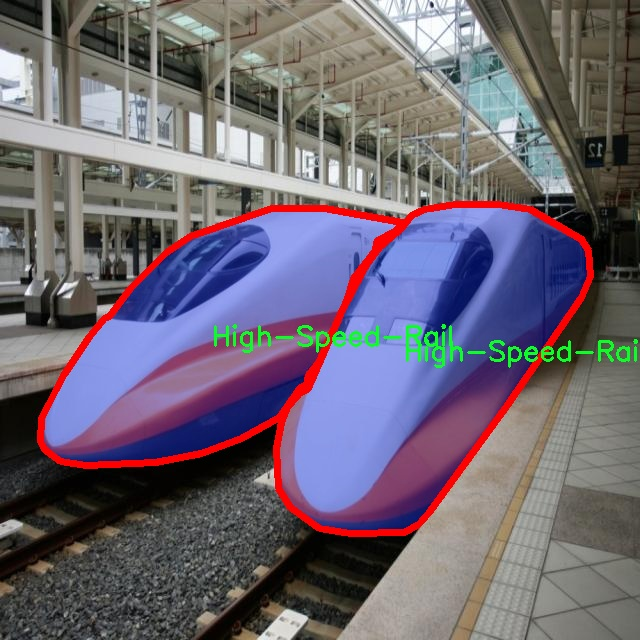
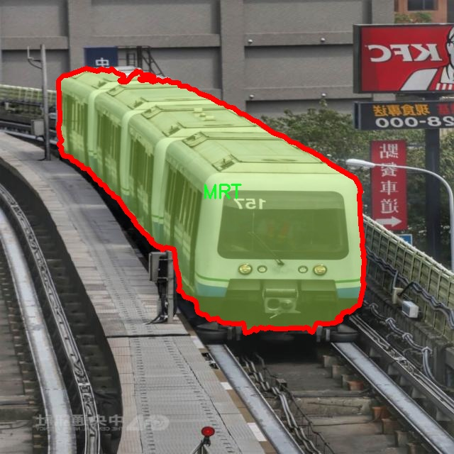
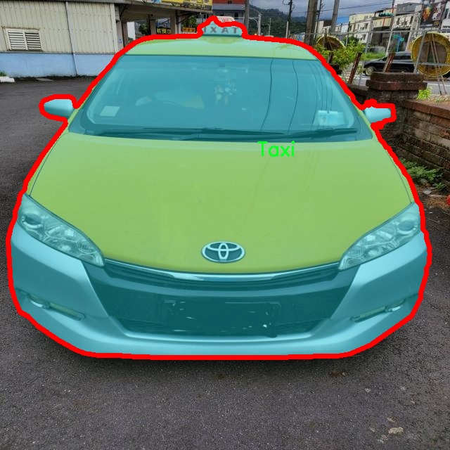

### 1.背景意义

研究背景与意义

随着城市化进程的加快，交通工具的种类和数量不断增加，交通管理的复杂性也随之加大。高效的交通工具检测与分割系统不仅能够提高交通管理的智能化水平，还能为城市交通规划、公共安全监控及智能出行服务提供重要的数据支持。近年来，深度学习技术在计算机视觉领域取得了显著进展，尤其是目标检测与分割任务中，YOLO（You Only Look Once）系列模型因其高效性和准确性而备受关注。YOLOv11作为该系列的最新版本，结合了多种先进的网络结构和算法优化，具备了更强的实时检测能力和更高的精度。

本研究旨在基于改进的YOLOv11模型，构建一个针对特定交通工具的检测与分割系统。所使用的数据集包含三类交通工具：高速铁路（High-Speed-Rail）、地铁（MRT）和出租车（Taxi），这些交通工具在现代城市交通中扮演着重要角色。通过对101幅图像的标注与处理，数据集为模型的训练提供了丰富的样本，确保了系统在多样化场景下的适应性和鲁棒性。

此外，交通工具的准确检测与分割不仅有助于交通流量的监测与分析，还能为智能交通系统的实现奠定基础。通过对交通工具的实时识别，城市管理者可以更好地进行交通调度，优化公共交通服务，提高出行效率。同时，该系统的应用还可以为交通事故的预防和应急响应提供数据支持，提升城市的安全性。

综上所述，基于改进YOLOv11的交通工具检测分割系统的研究，不仅具有重要的理论价值，也具备广泛的实际应用前景，为智能交通的发展提供了新的思路和解决方案。

### 2.视频效果

[2.1 视频效果](https://www.bilibili.com/video/BV1xqUJYFEdH/)

### 3.图片效果







##### [项目涉及的源码数据来源链接](https://kdocs.cn/l/cszuIiCKVNis)**

注意：本项目提供训练的数据集和训练教程,由于版本持续更新,暂不提供权重文件（best.pt）,请按照6.训练教程进行训练后实现上图演示的效果。

### 4.数据集信息

##### 4.1 本项目数据集类别数＆类别名

nc: 3
names: ['High-Speed-Rail', 'MRT', 'Taxi']


该项目为【图像分割】数据集，请在【训练教程和Web端加载模型教程（第三步）】这一步的时候按照【图像分割】部分的教程来训练

##### 4.2 本项目数据集信息介绍

本项目数据集信息介绍

本项目旨在改进YOLOv11的交通工具检测与分割系统，所使用的数据集围绕“Transportation”主题，专注于交通工具的多样性与复杂性。数据集中包含三种主要类别，分别为高铁（High-Speed-Rail）、地铁（MRT）和出租车（Taxi），共计类别数量为三。这些类别的选择不仅反映了现代城市交通的多样性，也突显了不同交通工具在城市环境中的重要性。

高铁作为一种高速、便捷的长途交通工具，近年来在全球范围内得到了广泛应用。数据集中关于高铁的图像和视频资料，涵盖了不同角度、不同时间段的高铁运行场景，旨在帮助模型学习识别高铁的特征与动态行为。地铁则是城市内部交通的重要组成部分，数据集中包含了多种地铁车型及其在车站、轨道等环境中的表现。这些数据将有助于模型在复杂的城市环境中准确识别地铁的存在与位置。

出租车作为城市交通的另一重要形式，其数据样本涵盖了各种类型的出租车，包括传统出租车和网约车。这些样本不仅展示了出租车在城市街道上的行驶状态，还包括了不同天气、光照条件下的表现，以增强模型的鲁棒性。通过对这三类交通工具的全面分析与标注，本项目的数据集为改进YOLOv11提供了丰富的训练素材，旨在提升模型在实际应用中的准确性与效率。

总之，本项目的数据集不仅在数量上涵盖了多样的交通工具，还在质量上提供了丰富的场景与条件，为交通工具检测与分割的研究提供了坚实的基础。通过对这些数据的深入挖掘与分析，期望能够推动交通工具智能识别技术的发展，为未来的智能交通系统奠定基础。










### 5.全套项目环境部署视频教程（零基础手把手教学）

[5.1 所需软件PyCharm和Anaconda安装教程（第一步）](https://www.bilibili.com/video/BV1BoC1YCEKi/?spm_id_from=333.999.0.0&vd_source=bc9aec86d164b67a7004b996143742dc)


[5.2 安装Python虚拟环境创建和依赖库安装视频教程（第二步）](https://www.bilibili.com/video/BV1ZoC1YCEBw?spm_id_from=333.788.videopod.sections&vd_source=bc9aec86d164b67a7004b996143742dc)

### 6.改进YOLOv11训练教程和Web_UI前端加载模型教程（零基础手把手教学）

[6.1 改进YOLOv11训练教程和Web_UI前端加载模型教程（第三步）](https://www.bilibili.com/video/BV1BoC1YCEhR?spm_id_from=333.788.videopod.sections&vd_source=bc9aec86d164b67a7004b996143742dc)


按照上面的训练视频教程链接加载项目提供的数据集，运行train.py即可开始训练



     Epoch   gpu_mem       box       obj       cls    labels  img_size
     1/200     20.8G   0.01576   0.01955  0.007536        22      1280: 100%|██████████| 849/849 [14:42<00:00,  1.04s/it]
               Class     Images     Labels          P          R     mAP@.5 mAP@.5:.95: 100%|██████████| 213/213 [01:14<00:00,  2.87it/s]
                 all       3395      17314      0.994      0.957      0.0957      0.0843

     Epoch   gpu_mem       box       obj       cls    labels  img_size
     2/200     20.8G   0.01578   0.01923  0.007006        22      1280: 100%|██████████| 849/849 [14:44<00:00,  1.04s/it]
               Class     Images     Labels          P          R     mAP@.5 mAP@.5:.95: 100%|██████████| 213/213 [01:12<00:00,  2.95it/s]
                 all       3395      17314      0.996      0.956      0.0957      0.0845

     Epoch   gpu_mem       box       obj       cls    labels  img_size
     3/200     20.8G   0.01561    0.0191  0.006895        27      1280: 100%|██████████| 849/849 [10:56<00:00,  1.29it/s]
               Class     Images     Labels          P          R     mAP@.5 mAP@.5:.95: 100%|███████   | 187/213 [00:52<00:00,  4.04it/s]
                 all       3395      17314      0.996      0.957      0.0957      0.0845


###### [项目数据集下载链接](https://kdocs.cn/l/cszuIiCKVNis)

### 7.原始YOLOv11算法讲解

##### YOLO11简介

> YOLO11源码地址：https://github.com/ultralytics/ultralytics

Ultralytics
YOLO11是一款尖端的、最先进的模型，它在之前YOLO版本成功的基础上进行了构建，并引入了新功能和改进，以进一步提升性能和灵活性。YOLO11设计快速、准确且易于使用，使其成为各种物体检测和跟踪、实例分割、图像分类以及姿态估计任务的绝佳选择。  


**YOLO11创新点如下:**

YOLO 11主要改进包括：  
`增强的特征提取`：YOLO 11采用了改进的骨干和颈部架构，增强了特征提取功能，以实现更精确的目标检测。  
`优化的效率和速度`：优化的架构设计和优化的训练管道提供更快的处理速度，同时保持准确性和性能之间的平衡。  
`更高的精度，更少的参数`：YOLO11m在COCO数据集上实现了更高的平均精度（mAP），参数比YOLOv8m少22%，使其在不影响精度的情况下提高了计算效率。  
`跨环境的适应性`：YOLO 11可以部署在各种环境中，包括边缘设备、云平台和支持NVIDIA GPU的系统。  
`广泛的支持任务`：YOLO 11支持各种计算机视觉任务，如对象检测、实例分割、图像分类、姿态估计和面向对象检测（OBB）。

**YOLO11不同模型尺寸信息：**

YOLO11 提供5种不同的型号规模模型，以满足不同的应用需求：

Model| size (pixels)| mAPval 50-95| Speed CPU ONNX (ms)| Speed T4 TensorRT10
(ms)| params (M)| FLOPs (B)  
---|---|---|---|---|---|---  
YOLO11n| 640| 39.5| 56.1 ± 0.8| 1.5 ± 0.0| 2.6| 6.5  
YOLO11s| 640| 47.0| 90.0 ± 1.2| 2.5 ± 0.0| 9.4| 21.5  
YOLO11m| 640| 51.5| 183.2 ± 2.0| 4.7 ± 0.1| 20.1| 68.0  
YOLO11l| 640| 53.4| 238.6 ± 1.4| 6.2 ± 0.1| 25.3| 86.9  
YOLO11x| 640| 54.7| 462.8 ± 6.7| 11.3 ± 0.2| 56.9| 194.9  
  
**模型常用训练超参数参数说明：**  
`YOLOv11
模型的训练设置包括训练过程中使用的各种超参数和配置`。这些设置会影响模型的性能、速度和准确性。关键的训练设置包括批量大小、学习率、动量和权重衰减。此外，优化器、损失函数和训练数据集组成的选择也会影响训练过程。对这些设置进行仔细的调整和实验对于优化性能至关重要。  
**以下是一些常用的模型训练参数和说明：**

参数名| 默认值| 说明  
---|---|---  
`model`| `None`| 指定用于训练的模型文件。接受指向 `.pt` 预训练模型或 `.yaml`
配置文件。对于定义模型结构或初始化权重至关重要。  
`data`| `None`| 数据集配置文件的路径（例如
`coco8.yaml`).该文件包含特定于数据集的参数，包括训练数据和验证数据的路径、类名和类数。  
`epochs`| `100`| 训练总轮数。每个epoch代表对整个数据集进行一次完整的训练。调整该值会影响训练时间和模型性能。  
`patience`| `100`| 在验证指标没有改善的情况下，提前停止训练所需的epoch数。当性能趋于平稳时停止训练，有助于防止过度拟合。  
`batch`| `16`| 批量大小，有三种模式:设置为整数(例如，’ Batch =16 ‘)， 60% GPU内存利用率的自动模式(’ Batch
=-1 ‘)，或指定利用率分数的自动模式(’ Batch =0.70 ')。  
`imgsz`| `640`| 用于训练的目标图像尺寸。所有图像在输入模型前都会被调整到这一尺寸。影响模型精度和计算复杂度。  
`device`| `None`| 指定用于训练的计算设备：单个 GPU (`device=0`）、多个 GPU (`device=0,1`)、CPU
(`device=cpu`)，或苹果芯片的 MPS (`device=mps`).  
`workers`| `8`| 加载数据的工作线程数（每 `RANK` 多 GPU 训练）。影响数据预处理和输入模型的速度，尤其适用于多 GPU 设置。  
`name`| `None`| 训练运行的名称。用于在项目文件夹内创建一个子目录，用于存储训练日志和输出结果。  
`pretrained`| `True`| 决定是否从预处理模型开始训练。可以是布尔值，也可以是加载权重的特定模型的字符串路径。提高训练效率和模型性能。  
`optimizer`| `'auto'`| 为训练模型选择优化器。选项包括 `SGD`, `Adam`, `AdamW`, `NAdam`,
`RAdam`, `RMSProp` 等，或 `auto` 用于根据模型配置进行自动选择。影响收敛速度和稳定性  
`lr0`| `0.01`| 初始学习率（即 `SGD=1E-2`, `Adam=1E-3`) .调整这个值对优化过程至关重要，会影响模型权重的更新速度。  
`lrf`| `0.01`| 最终学习率占初始学习率的百分比 = (`lr0 * lrf`)，与调度程序结合使用，随着时间的推移调整学习率。  


**各损失函数作用说明：**  
`定位损失box_loss`：预测框与标定框之间的误差（GIoU），越小定位得越准；  
`分类损失cls_loss`：计算锚框与对应的标定分类是否正确，越小分类得越准；  
`动态特征损失（dfl_loss）`：DFLLoss是一种用于回归预测框与目标框之间距离的损失函数。在计算损失时，目标框需要缩放到特征图尺度，即除以相应的stride，并与预测的边界框计算Ciou
Loss，同时与预测的anchors中心点到各边的距离计算回归DFLLoss。  


### 8.200+种全套改进YOLOV11创新点原理讲解

#### 8.1 200+种全套改进YOLOV11创新点原理讲解大全

由于篇幅限制，每个创新点的具体原理讲解就不全部展开，具体见下列网址中的改进模块对应项目的技术原理博客网址【Blog】（创新点均为模块化搭建，原理适配YOLOv5~YOLOv11等各种版本）

[改进模块技术原理博客【Blog】网址链接](https://gitee.com/qunmasj/good)


#### 8.2 精选部分改进YOLOV11创新点原理讲解

###### 这里节选部分改进创新点展开原理讲解(完整的改进原理见上图和[改进模块技术原理博客链接](https://gitee.com/qunmasj/good)【如果此小节的图加载失败可以通过CSDN或者Github搜索该博客的标题访问原始博客，原始博客图片显示正常】

### 可扩张残差（DWR）注意力模块
当前的许多工作直接采用多速率深度扩张卷积从一个输入特征图中同时捕获多尺度上下文信息，从而提高实时语义分割的特征提取效率。 然而，这种设计可能会因为结构和超参数的不合理而导致多尺度上下文信息的访问困难。 为了降低绘制多尺度上下文信息的难度，我们提出了一种高效的多尺度特征提取方法，该方法分解了原始的单步特征提取方法方法分为两个步骤，区域残差-语义残差。 在该方法中，多速率深度扩张卷积在特征提取中发挥更简单的作用：根据第一步提供的每个简明区域形式特征图，在第二步中使用一个所需的感受野执行简单的基于语义的形态过滤 一步，提高他们的效率。 此外，扩张率和扩张卷积的容量每个网络阶段都经过精心设计，以充分利用所有可以实现的区域形式的特征图。 因此，我们分别为高层和低层网络设计了一种新颖的扩张式残差（DWR）模块和简单倒置残差（SIR）模块。


首先，该博客引入了一个Dilation-wise Residual（DWR）模块，用于提取网络高层的特征，如图2a所示。多分支结构用于扩展感受野，其中每个分支采用不同空洞率的空洞深度卷积。
然后，专门设计了一个Simple Inverted Residual（SIR）模块来提取网络低层的特征，如图2b所示。该模块仅具有3×3的微小感受野，但使用inverted bottleneck式结构来扩展通道数量，确保更强的特征提取能力。
最后，基于DWR和SIR模块，构建了一个编码器-解码器风格的网络DWRSeg，其中解码器采用了简单的类似FCN的结构。解码器使用来自最后两个阶段的强语义信息直接对特征图进行上采样，然后将它们与来自较低阶段的特征图（包含丰富的详细信息）拼接起来，以进行最终预测。


### 9.系统功能展示

图9.1.系统支持检测结果表格显示

  图9.2.系统支持置信度和IOU阈值手动调节

  图9.3.系统支持自定义加载权重文件best.pt(需要你通过步骤5中训练获得)

  图9.4.系统支持摄像头实时识别

  图9.5.系统支持图片识别

  图9.6.系统支持视频识别

  图9.7.系统支持识别结果文件自动保存

  图9.8.系统支持Excel导出检测结果数据


### 10. YOLOv11核心改进源码讲解

#### 10.1 val.py

以下是经过简化和注释的核心代码部分，主要集中在YOLO模型的验证过程。注释详细解释了每个方法的功能和重要性。

```python
import os
import torch
from ultralytics.engine.validator import BaseValidator
from ultralytics.utils import LOGGER, ops
from ultralytics.utils.metrics import ConfusionMatrix, DetMetrics, box_iou

class DetectionValidator(BaseValidator):
    """
    扩展自BaseValidator类的检测模型验证器。
    """

    def __init__(self, dataloader=None, save_dir=None, pbar=None, args=None, _callbacks=None):
        """初始化检测模型所需的变量和设置。"""
        super().__init__(dataloader, save_dir, pbar, args, _callbacks)
        self.metrics = DetMetrics(save_dir=self.save_dir)  # 初始化检测指标
        self.iouv = torch.linspace(0.5, 0.95, 10)  # mAP@0.5:0.95的IoU向量

    def preprocess(self, batch):
        """预处理图像批次以进行YOLO训练。"""
        batch["img"] = batch["img"].to(self.device, non_blocking=True)  # 将图像转移到设备
        batch["img"] = batch["img"].float() / 255  # 归一化图像
        for k in ["batch_idx", "cls", "bboxes"]:
            batch[k] = batch[k].to(self.device)  # 将标签和边界框转移到设备
        return batch

    def postprocess(self, preds):
        """对预测输出应用非极大值抑制（NMS）。"""
        return ops.non_max_suppression(
            preds,
            self.args.conf,
            self.args.iou,
            multi_label=True,
            agnostic=self.args.single_cls,
            max_det=self.args.max_det,
        )

    def update_metrics(self, preds, batch):
        """更新检测指标。"""
        for si, pred in enumerate(preds):
            npr = len(pred)  # 当前预测的数量
            pbatch = self._prepare_batch(si, batch)  # 准备当前批次的数据
            cls, bbox = pbatch.pop("cls"), pbatch.pop("bbox")  # 获取真实标签
            if npr == 0:  # 如果没有预测
                continue

            predn = self._prepare_pred(pred, pbatch)  # 准备预测数据
            # 评估
            if len(cls):
                tp = self._process_batch(predn, bbox, cls)  # 处理预测和真实框
                self.metrics.process(tp=tp)  # 更新指标

    def _process_batch(self, detections, gt_bboxes, gt_cls):
        """
        返回正确的预测矩阵。
        """
        iou = box_iou(gt_bboxes, detections[:, :4])  # 计算IoU
        return self.match_predictions(detections[:, 5], gt_cls, iou)  # 匹配预测和真实标签

    def print_results(self):
        """打印每个类的训练/验证集指标。"""
        LOGGER.info(f"Results: {self.metrics.mean_results()}")  # 打印平均结果

    def eval_json(self, stats):
        """评估YOLO输出的JSON格式并返回性能统计信息。"""
        # 这里可以实现COCO格式的评估
        pass  # 省略具体实现
```

### 代码分析
1. **DetectionValidator类**: 该类用于验证YOLO模型的性能，继承自`BaseValidator`，包含了数据预处理、后处理、指标更新等功能。
  
2. **初始化方法**: 在初始化时设置了一些基本参数，包括检测指标的初始化和IoU的范围。

3. **预处理方法**: 负责将输入图像归一化并转移到计算设备上，同时准备标签和边界框。

4. **后处理方法**: 应用非极大值抑制（NMS）来过滤掉重叠的检测框，提高检测精度。

5. **更新指标方法**: 计算每个批次的检测结果，并更新相关的检测指标。

6. **处理批次方法**: 计算IoU并匹配预测框与真实框，以评估模型的性能。

7. **打印结果方法**: 输出每个类的平均检测结果，便于分析模型的表现。

8. **评估JSON方法**: 用于将检测结果以COCO格式保存并进行评估，具体实现可以根据需要补充。

以上代码是YOLO模型验证的核心部分，提供了数据处理、指标计算和结果输出的基本框架。

这个程序文件 `val.py` 是一个用于验证 YOLO（You Only Look Once）目标检测模型的类，名为 `DetectionValidator`，它继承自 `BaseValidator`。该类的主要功能是处理验证数据集，计算模型的性能指标，并可视化结果。

在初始化时，`DetectionValidator` 接收多个参数，包括数据加载器、保存目录、进度条、参数字典和回调函数。初始化过程中，它设置了一些属性，如每个类别的目标数量、是否使用 COCO 数据集、类别映射等。同时，它还创建了一个用于计算检测指标的 `DetMetrics` 实例，并定义了一个 IoU（Intersection over Union）向量，用于计算 mAP（mean Average Precision）。

`preprocess` 方法用于对输入的图像批次进行预处理，包括将图像数据转换为适合模型输入的格式，处理边界框的坐标等。如果设置了保存混合数据的选项，它还会为自动标注准备数据。

`init_metrics` 方法初始化模型评估所需的指标，包括确定数据集是否为 COCO 格式，并根据模型的类别名称设置相应的属性。

`get_desc` 方法返回一个格式化的字符串，用于描述模型的类别指标。

`postprocess` 方法应用非极大值抑制（NMS）来处理模型的预测输出，以减少重叠的边界框。

`_prepare_batch` 和 `_prepare_pred` 方法分别用于准备验证批次的真实标签和模型预测的边界框，以便后续的评估。

`update_metrics` 方法用于更新模型的性能指标，包括计算真正例、预测类别等。它还支持将预测结果保存为 JSON 或 TXT 格式。

`finalize_metrics` 方法设置最终的指标值，包括速度和混淆矩阵。

`get_stats` 方法返回性能统计数据和结果字典。

`print_results` 方法打印每个类别的训练/验证集指标，并在需要时绘制混淆矩阵。

`_process_batch` 方法计算预测的正确性，返回一个正确预测矩阵。

`build_dataset` 和 `get_dataloader` 方法用于构建 YOLO 数据集和返回数据加载器。

`plot_val_samples` 和 `plot_predictions` 方法用于可视化验证样本和模型的预测结果。

`save_one_txt` 方法将 YOLO 检测结果保存为特定格式的 TXT 文件，而 `pred_to_json` 方法则将预测结果序列化为 COCO JSON 格式。

最后，`eval_json` 方法用于评估 JSON 格式的 YOLO 输出，并返回性能统计数据。它利用 COCO API 计算 mAP，并在验证结束时输出结果。

整体而言，这个文件实现了一个完整的目标检测模型验证流程，包括数据预处理、模型评估、结果可视化和性能统计。

#### 10.2 CSwomTramsformer.py

以下是经过简化并注释的核心代码部分，主要保留了CSWin Transformer的结构和功能：

```python
import torch
import torch.nn as nn
import numpy as np

class Mlp(nn.Module):
    """多层感知机（MLP）模块"""
    def __init__(self, in_features, hidden_features=None, out_features=None, act_layer=nn.GELU, drop=0.):
        super().__init__()
        out_features = out_features or in_features  # 输出特征数
        hidden_features = hidden_features or in_features  # 隐藏层特征数
        self.fc1 = nn.Linear(in_features, hidden_features)  # 第一层线性变换
        self.act = act_layer()  # 激活函数
        self.fc2 = nn.Linear(hidden_features, out_features)  # 第二层线性变换
        self.drop = nn.Dropout(drop)  # Dropout层

    def forward(self, x):
        """前向传播"""
        x = self.fc1(x)
        x = self.act(x)
        x = self.drop(x)
        x = self.fc2(x)
        x = self.drop(x)
        return x

class CSWinBlock(nn.Module):
    """CSWin Transformer的基本块"""
    def __init__(self, dim, num_heads, mlp_ratio=4., drop=0., attn_drop=0., norm_layer=nn.LayerNorm):
        super().__init__()
        self.dim = dim  # 输入特征维度
        self.num_heads = num_heads  # 注意力头数
        self.mlp_ratio = mlp_ratio  # MLP的隐藏层比率
        self.norm1 = norm_layer(dim)  # 第一层归一化
        self.qkv = nn.Linear(dim, dim * 3)  # 线性变换生成Q、K、V

        # 注意力层
        self.attn = LePEAttention(dim, num_heads=num_heads, attn_drop=attn_drop)

        # MLP层
        mlp_hidden_dim = int(dim * mlp_ratio)
        self.mlp = Mlp(in_features=dim, hidden_features=mlp_hidden_dim, out_features=dim)
        self.norm2 = norm_layer(dim)  # 第二层归一化

    def forward(self, x):
        """前向传播"""
        x = self.norm1(x)  # 归一化
        qkv = self.qkv(x).reshape(x.shape[0], -1, 3, self.dim).permute(2, 0, 1, 3)  # 生成Q、K、V
        x = self.attn(qkv)  # 注意力计算
        x = x + self.norm2(self.mlp(x))  # MLP处理并添加残差连接
        return x

class CSWinTransformer(nn.Module):
    """CSWin Transformer模型"""
    def __init__(self, img_size=640, in_chans=3, num_classes=1000, embed_dim=96, depth=[2, 2, 6, 2], num_heads=12):
        super().__init__()
        self.num_classes = num_classes
        self.embed_dim = embed_dim

        # 输入层
        self.stage1_conv_embed = nn.Sequential(
            nn.Conv2d(in_chans, embed_dim, kernel_size=7, stride=4, padding=2),
            nn.LayerNorm(embed_dim)
        )

        # Transformer的多个阶段
        self.stage1 = nn.ModuleList([
            CSWinBlock(dim=embed_dim, num_heads=num_heads) for _ in range(depth[0])
        ])
        # 这里可以继续添加stage2, stage3, stage4等...

    def forward(self, x):
        """前向传播"""
        x = self.stage1_conv_embed(x)  # 输入层处理
        for blk in self.stage1:
            x = blk(x)  # 通过每个CSWinBlock
        return x

# 示例：创建CSWinTransformer模型并进行前向传播
if __name__ == '__main__':
    inputs = torch.randn((1, 3, 640, 640))  # 输入图像
    model = CSWinTransformer()  # 创建模型
    res = model(inputs)  # 前向传播
    print(res.size())  # 输出结果的尺寸
```

### 代码说明：
1. **Mlp类**：实现了一个简单的多层感知机，包含两层线性变换和一个激活函数，支持Dropout。
2. **CSWinBlock类**：实现了CSWin Transformer的基本构建块，包含注意力机制和MLP，支持残差连接和归一化。
3. **CSWinTransformer类**：构建了整个CSWin Transformer模型，包含输入层和多个CSWinBlock。
4. **前向传播**：在`__main__`部分，创建了一个模型实例并进行了前向传播，输出结果的尺寸。 

该代码结构清晰，注释详细，便于理解CSWin Transformer的核心部分。

这个程序文件实现了一个名为CSWin Transformer的深度学习模型，主要用于计算机视觉任务。代码中包含了多个类和函数，构成了整个模型的架构。

首先，文件导入了必要的库，包括PyTorch和一些用于图像处理和模型构建的工具。接着，定义了几个重要的组件。

`Mlp`类实现了一个多层感知机（MLP），包含两个线性层和一个激活函数（默认为GELU），用于在Transformer的每个块中进行特征转换。

`LePEAttention`类实现了一个局部增强注意力机制（LEPE Attention），其核心是将输入图像划分为窗口，并在这些窗口上计算注意力。该类中定义了如何将输入转换为窗口格式、计算注意力权重以及将注意力应用于值（value）上。

`CSWinBlock`类是CSWin Transformer的基本构建块，包含了注意力层和MLP层。它通过对输入进行归一化、计算QKV（查询、键、值）表示、应用注意力机制以及通过MLP进行特征转换来处理输入。

`img2windows`和`windows2img`函数用于将图像从常规格式转换为窗口格式，反之亦然，方便在注意力计算中进行处理。

`Merge_Block`类用于在不同阶段之间合并特征，通常是通过卷积层进行下采样，并进行归一化处理。

`CSWinTransformer`类是整个模型的主体，负责构建模型的不同阶段。它首先通过卷积层将输入图像嵌入到一个高维空间，然后依次通过多个CSWinBlock进行特征提取。每个阶段后都有一个Merge_Block，用于合并和下采样特征。

模型的初始化过程中，定义了各个阶段的深度、头数、MLP比例等超参数，并且支持预训练权重的加载。

文件的最后部分定义了一些模型的变体（如CSWin_tiny、CSWin_small等），并提供了加载预训练权重的功能。

在`__main__`部分，程序创建了随机输入，并测试了不同规模的CSWin Transformer模型，输出每个模型的特征图大小。

总体而言，这个文件实现了一个复杂的视觉Transformer模型，结合了局部增强注意力机制和多层感知机，适用于各种计算机视觉任务。

#### 10.3 efficientViT.py

以下是代码中最核心的部分，并附上详细的中文注释：

```python
import torch
import torch.nn as nn
import torch.nn.functional as F
import itertools

class Conv2d_BN(torch.nn.Sequential):
    """带有BatchNorm的卷积层"""
    def __init__(self, in_channels, out_channels, kernel_size=1, stride=1, padding=0, dilation=1,
                 groups=1, bn_weight_init=1):
        super().__init__()
        # 添加卷积层
        self.add_module('c', torch.nn.Conv2d(
            in_channels, out_channels, kernel_size, stride, padding, dilation, groups, bias=False))
        # 添加BatchNorm层
        self.add_module('bn', torch.nn.BatchNorm2d(out_channels))
        # 初始化BatchNorm的权重和偏置
        torch.nn.init.constant_(self.bn.weight, bn_weight_init)
        torch.nn.init.constant_(self.bn.bias, 0)

    @torch.no_grad()
    def switch_to_deploy(self):
        """将训练模式转换为推理模式，合并卷积和BatchNorm"""
        c, bn = self._modules.values()
        w = bn.weight / (bn.running_var + bn.eps)**0.5
        w = c.weight * w[:, None, None, None]
        b = bn.bias - bn.running_mean * bn.weight / (bn.running_var + bn.eps)**0.5
        m = torch.nn.Conv2d(w.size(1) * self.c.groups, w.size(0), w.shape[2:], stride=self.c.stride, padding=self.c.padding, dilation=self.c.dilation, groups=self.c.groups)
        m.weight.data.copy_(w)
        m.bias.data.copy_(b)
        return m

class EfficientViTBlock(torch.nn.Module):
    """EfficientViT的基本构建块"""
    def __init__(self, ed, kd, nh=8, ar=4, resolution=14, window_resolution=7):
        super().__init__()
        # 残差卷积层
        self.dw0 = Residual(Conv2d_BN(ed, ed, 3, 1, 1, groups=ed))
        # 残差前馈网络
        self.ffn0 = Residual(FFN(ed, int(ed * 2)))

        # 自注意力机制
        self.mixer = Residual(LocalWindowAttention(ed, kd, nh, attn_ratio=ar, resolution=resolution, window_resolution=window_resolution))

        # 另一个残差卷积层和前馈网络
        self.dw1 = Residual(Conv2d_BN(ed, ed, 3, 1, 1, groups=ed))
        self.ffn1 = Residual(FFN(ed, int(ed * 2)))

    def forward(self, x):
        """前向传播"""
        return self.ffn1(self.dw1(self.mixer(self.ffn0(self.dw0(x)))))

class EfficientViT(torch.nn.Module):
    """EfficientViT模型"""
    def __init__(self, img_size=400, patch_size=16, in_chans=3, embed_dim=[64, 128, 192], depth=[1, 2, 3], num_heads=[4, 4, 4], window_size=[7, 7, 7]):
        super().__init__()
        # 图像嵌入层
        self.patch_embed = torch.nn.Sequential(
            Conv2d_BN(in_chans, embed_dim[0] // 8, 3, 2, 1),
            torch.nn.ReLU(),
            Conv2d_BN(embed_dim[0] // 8, embed_dim[0] // 4, 3, 2, 1),
            torch.nn.ReLU(),
            Conv2d_BN(embed_dim[0] // 4, embed_dim[0] // 2, 3, 2, 1),
            torch.nn.ReLU(),
            Conv2d_BN(embed_dim[0] // 2, embed_dim[0], 3, 1, 1)
        )

        # 构建各个块
        self.blocks = []
        for i in range(len(depth)):
            for _ in range(depth[i]):
                self.blocks.append(EfficientViTBlock(embed_dim[i], embed_dim[i] // 4, num_heads[i], window_size[i]))
        self.blocks = torch.nn.Sequential(*self.blocks)

    def forward(self, x):
        """前向传播"""
        x = self.patch_embed(x)  # 图像嵌入
        x = self.blocks(x)  # 通过所有块
        return x

# 示例模型创建
if __name__ == '__main__':
    model = EfficientViT(img_size=224, patch_size=16)
    inputs = torch.randn((1, 3, 640, 640))  # 随机输入
    res = model(inputs)  # 模型推理
    print(res.size())  # 输出结果的尺寸
```

### 代码核心部分说明：
1. **Conv2d_BN**: 这是一个组合了卷积层和批归一化层的模块，能够在训练和推理时进行不同的处理。
2. **EfficientViTBlock**: 这是EfficientViT模型的基本构建块，包含卷积层、前馈网络和自注意力机制。
3. **EfficientViT**: 这是整个模型的实现，包含图像嵌入层和多个EfficientViTBlock的堆叠。
4. **forward方法**: 这是模型的前向传播逻辑，处理输入数据并返回输出。

通过这些核心部分的组合，EfficientViT模型能够有效地处理图像数据并进行特征提取。

这个程序文件实现了一个高效的视觉变换器（EfficientViT）模型架构，主要用于下游任务。代码中包含了多个类和函数，构成了整个模型的结构。

首先，文件引入了必要的库，包括PyTorch和一些自定义的层。然后定义了多个模型版本的配置，如`EfficientViT_m0`到`EfficientViT_m5`，这些配置指定了不同的超参数，如图像大小、嵌入维度、深度等。

接下来，定义了多个类。`Conv2d_BN`类实现了卷积层和批归一化的组合，并提供了一个方法用于在推理时切换到部署模式。`replace_batchnorm`函数用于替换模型中的批归一化层，以提高推理效率。

`PatchMerging`类负责将输入特征图进行合并，`Residual`类实现了残差连接，`FFN`类实现了前馈神经网络。`CascadedGroupAttention`和`LocalWindowAttention`类实现了不同类型的注意力机制，用于处理输入特征的相关性。

`EfficientViTBlock`类是构建高效视觉变换器的基本模块，包含卷积、前馈网络和注意力机制。`EfficientViT`类则是整个模型的主类，负责将不同的模块组合在一起，并实现前向传播。

在`EfficientViT`类的构造函数中，首先进行图像的嵌入，然后根据不同的阶段（如`blocks1`、`blocks2`、`blocks3`）逐步处理特征图。每个阶段可以包含多个块，并根据配置进行下采样。

最后，文件提供了多个模型构造函数（如`EfficientViT_M0`到`EfficientViT_M5`），这些函数可以根据预设的配置创建模型实例，并支持加载预训练权重和批归一化的替换。

在`__main__`部分，代码示例了如何创建一个模型实例并进行前向传播，输入一个随机生成的张量，并打印输出特征图的尺寸。

总体而言，这个程序文件实现了一个灵活且高效的视觉变换器模型，适用于各种计算机视觉任务。

#### 10.4 mamba_vss.py

以下是代码中最核心的部分，并附上详细的中文注释：

```python
import torch
import torch.nn as nn
import torch.nn.functional as F
from einops import repeat
from functools import partial

class SS2D(nn.Module):
    def __init__(self, d_model, d_state=16, d_conv=3, expand=2, dropout=0., device=None, dtype=None):
        super().__init__()
        # 模型参数初始化
        self.d_model = d_model  # 输入特征维度
        self.d_state = d_state  # 状态维度
        self.d_conv = d_conv  # 卷积核大小
        self.expand = expand  # 扩展因子
        self.d_inner = int(self.expand * self.d_model)  # 内部特征维度

        # 输入线性变换
        self.in_proj = nn.Linear(self.d_model, self.d_inner * 2)  # 输入特征到内部特征的线性变换

        # 卷积层
        self.conv2d = nn.Conv2d(
            in_channels=self.d_inner,
            out_channels=self.d_inner,
            groups=self.d_inner,
            kernel_size=d_conv,
            padding=(d_conv - 1) // 2,
        )
        self.act = nn.SiLU()  # 激活函数

        # 状态和时间步长的线性变换
        self.x_proj_weight = nn.Parameter(torch.empty(4, self.d_inner, self.d_state * 2))  # 状态的权重
        self.dt_projs_weight = nn.Parameter(torch.empty(4, self.d_inner, self.d_state))  # 时间步长的权重
        self.dt_projs_bias = nn.Parameter(torch.empty(4, self.d_inner))  # 时间步长的偏置

        # 初始化A和D参数
        self.A_logs = self.A_log_init(self.d_state, self.d_inner)  # A参数
        self.Ds = self.D_init(self.d_inner)  # D参数

        # 输出层
        self.out_norm = nn.LayerNorm(self.d_inner)  # 层归一化
        self.out_proj = nn.Linear(self.d_inner, self.d_model)  # 输出线性变换
        self.dropout = nn.Dropout(dropout) if dropout > 0. else None  # Dropout层

    def forward(self, x: torch.Tensor):
        # 前向传播
        B, H, W, C = x.shape  # 获取输入的形状
        xz = self.in_proj(x)  # 输入通过线性变换
        x, z = xz.chunk(2, dim=-1)  # 分割为x和z

        x = x.permute(0, 3, 1, 2).contiguous()  # 调整维度顺序
        x = self.act(self.conv2d(x))  # 卷积操作后激活
        y = self.forward_core(x)  # 核心前向传播
        y = y * F.silu(z)  # 与z进行逐元素相乘
        out = self.out_proj(y)  # 输出线性变换
        if self.dropout is not None:
            out = self.dropout(out)  # 应用Dropout
        return out

    def forward_core(self, x: torch.Tensor):
        # 核心前向传播逻辑
        B, C, H, W = x.shape
        L = H * W
        K = 4

        # 处理输入
        x_hwwh = torch.stack([x.view(B, -1, L), torch.transpose(x, dim0=2, dim1=3).contiguous().view(B, -1, L)], dim=1).view(B, 2, -1, L)
        xs = torch.cat([x_hwwh, torch.flip(x_hwwh, dims=[-1])], dim=1)  # 处理后的输入

        # 计算dts, Bs, Cs
        x_dbl = torch.einsum("b k d l, k c d -> b k c l", xs.view(B, K, -1, L), self.x_proj_weight)
        dts, Bs, Cs = torch.split(x_dbl, [self.dt_rank, self.d_state, self.d_state], dim=2)

        # 进一步处理
        dts = torch.einsum("b k r l, k d r -> b k d l", dts.view(B, K, -1, L), self.dt_projs_weight)

        # 选择性扫描
        out_y = self.selective_scan(xs, dts, self.A_logs, Bs, Cs, self.Ds)
        y = out_y.view(B, H, W, -1)  # 调整输出形状
        y = self.out_norm(y)  # 归一化
        return y

class VSSBlock(nn.Module):
    def __init__(self, hidden_dim: int = 0, drop_path: float = 0.2):
        super().__init__()
        self.ln_1 = nn.LayerNorm(hidden_dim)  # 归一化层
        self.self_attention = SS2D(d_model=hidden_dim)  # 自注意力层
        self.drop_path = nn.Dropout(drop_path)  # DropPath层

    def forward(self, input: torch.Tensor):
        input = input.permute((0, 2, 3, 1))  # 调整输入维度
        x = input + self.drop_path(self.self_attention(self.ln_1(input)))  # 残差连接
        return x.permute((0, 3, 1, 2))  # 调整输出维度

# 示例代码用于测试模型
if __name__ == '__main__':
    inputs = torch.randn((1, 64, 32, 32)).cuda()  # 随机输入
    model = VSSBlock(64).cuda()  # 创建模型
    pred = model(inputs)  # 前向传播
    print(pred.size())  # 输出结果的尺寸
```

### 代码说明：
1. **SS2D类**：实现了一个包含卷积和自注意力机制的模块。它的构造函数初始化了多个线性层和卷积层，并定义了前向传播的逻辑。
2. **forward方法**：实现了输入的前向传播，包括线性变换、卷积、激活函数、核心前向传播和输出变换。
3. **VSSBlock类**：是一个包含归一化和自注意力机制的模块，使用了SS2D作为自注意力层。
4. **主函数**：用于测试模型的创建和前向传播。

这个程序文件 `mamba_vss.py` 实现了一个深度学习模型的构建，主要包含了两个类：`SS2D` 和 `VSSBlock`，以及其子类 `Mamba2Block`。这些类是基于 PyTorch 框架构建的，主要用于实现某种形式的自注意力机制。

首先，`SS2D` 类是一个自定义的神经网络模块，继承自 `nn.Module`。在其初始化方法中，定义了一系列参数，包括模型的维度、状态维度、卷积核大小、扩展因子等。该类的核心是通过线性变换和卷积操作来处理输入数据。`dt_init`、`A_log_init` 和 `D_init` 等静态方法用于初始化模型中的一些参数，如时间步长、状态矩阵等。

在 `forward_corev0` 方法中，模型实现了一个前向传播的核心逻辑，使用了选择性扫描的操作来处理输入数据。输入数据首先被重塑和转置，然后通过一系列的线性变换和卷积操作进行处理，最终生成输出。这个过程涉及到对输入数据的多种变换和组合，体现了模型的复杂性。

接下来，`VSSBlock` 类同样继承自 `nn.Module`，它实现了一个包含自注意力机制的块。在初始化中，使用了 `SS2D` 作为自注意力模块，并且加入了层归一化和随机丢弃路径的功能。在 `forward` 方法中，输入数据经过层归一化后传入自注意力模块，并与原始输入相加，形成残差连接。

`Mamba2Block` 类是 `VSSBlock` 的子类，重写了自注意力模块为 `Mamba2Simple`，并在前向传播中对输入数据进行了适当的重塑和处理，以适应新的自注意力实现。

在文件的最后部分，提供了一个简单的测试示例，生成随机输入数据并通过 `VSSBlock` 和 `Mamba2Block` 进行前向传播，输出预测结果的尺寸。这部分代码可以用来验证模型的基本功能和结构是否正确。

整体来看，这个程序文件展示了如何使用 PyTorch 构建复杂的自注意力机制模块，并通过层归一化和残差连接等技术来增强模型的表现。

### 11.完整训练+Web前端界面+200+种全套创新点源码、数据集获取


# [下载链接：F:\Temporary](F:\Temporary)